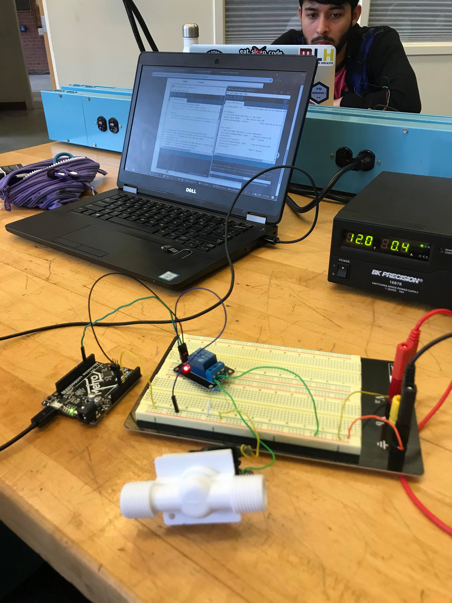

# Don't kill your plants!

**Author(s)**: Natasha Stallsmith and Tirtha Subedi

**Google Document**: https://docs.google.com/document/d/16PQsD9lrPFoG10iWvd56AJSm8ZgAgtpKkd_IgjPh894/edit?usp=sharing

---
## Purpose
We all love plants, we all need plants, and in fact, studies have shown that having plants around can help reduce stress. At the same time, however, indoor plants can be hard to take care of because it requires us remembering to water them which another task on top of all of the tasks we have to do. Not only that, but we have to remember when was the last time we watered them so as not to overwater them. Our hope is that though this project we can making caring for a plant much easier by creating an embedded system which measures the water density in your plants soil and lets you know (by a little light) when it is time to water your plant again.

## Initial Design Plan

**Hardware:**
- LEDs: Red and Green
- Soil moisture sensor
- Arduino metro
- Breadboard 
- Jumper Wires
- Solenoid Valve
- Relay

  
**Code:**

We will start with the AnalogReadSerial example code.

- Initialize all variables, including pin numbers and threshold value.

Setup:
- Begin serial moniter
- Declare pin modes
- Make sure no power is flowing to sensor

Loop:
- Take reading from sensor using readsoil function and print value to serial monitor
- If the moisture is over the threshold value, turn white light on and red light off
- If the moisture is below the threshold value, turn red light on and white light off, also open Solenoid valve for one second
- Delay -- for testing it is set to a short value, but in practice it could be refreshed about every 30 mins

Readsoil Function:
- Send power to sensor
- Delay a few milliseconds
- Read value from sensor
- Turn off power to sensor
- Return moisture level value

## Files

- README (you are here): Documentation of our project.
- LICENSE: Licensing info.
- Soil_Moisture_Project_1.ino: The Arduino code file for the project.
- design_diagram.jpeg: Diagram of our hardware design plan.
- Various jpg images to capture the progress of our project.

## Summary
Our initial plan for the project was to display level of moisture in a plant's soil by using two different LED color, if the soil is damp then Green LED would light up and if the soil moisture is too dry then Red LED would light up. After successfully completing the initial plan then we decided to advance it by adding an auto-watering feature. We were able to add this feature by connecting a solenoid water-valve and modifying our code. Now, when a user places the soil moisture sensor in the soil, it reads the moisture input, the appropriate LED will light up, and the water-valve will open for one second if the soil is really dry. This will let water flow through the valve and into the pot such that the next time the moisture sensor takes a reading it will find that the soil is damp and the plant will not be watered again until the soil has dried out.

We spent a lot of time on researching about the different components (parts), design of the project, and implementating the program to do what we wanted it to do. In particular, the most complex part of our project was determining how to get the switch for the water-valve to work. We first tried a transitor, but eventually settled on using a relay. The required circuit for this was very different than what we had done before, so it was both a bit difficult and rewarding to complete and debug. Overall, this project helped us to grow our skills in implementing a program, designing on a breadboard, and researching creatively to get the right result. We also feel that we have much better knowledge now of how to debug a circuit when you don't know whether the code or the hardware is at fault. We have overcome many challenges throughout the corse of this project and in the end it feels really good to be rewarded with achievement and success.   

## Instructions
   - Ensure all the wires maintain connection and nothing has been broken in transport.
   - Connect arduino to power supply or laptop.
   - Connect a 12V power supply to the breadboard.
   - Place the forked soil moisture sensor in the plant's soil.
   - Mount the solednoid water-valve above the pot with the arrow pointing down.
   - Fill the pipe attached to the water-valve as full as possible without letting water spill out.
   - Go about your day without worrying about the well-being of your plant! (Aside from the possibility of the water-valve and attached large pipe falling and crushing it.)
   - Now you don't have to remember to water your plant, merely to refill the water in your autowatering system.

## Errors and Constraints
   - The circuitry is rather complex and not easily contained or transported. As is, the system is not convenient for use because of all the exposed wires and relatively short connections between different components.
   - The pipe holding the water would have to be refilled fairly often because it does not hold much water and does not have a hose attached.
   - The system is not very power efficient -- a power supply must be connected to the arduino in addition to a 12V power supply connected to the breadboard.

## Reflection
At first, we were really confused on what project idea shall we proceed? and when we did the two days journal entries it     gave us many project ideas which are dealing with daily need of the people. Among al those great ideas, we decided to go for "Don't Kill your Plants" idea. The inspiration for this idea comes from the lifestyle that we are living into, therefore We are living in the busy world and we often forget to take care of our plants; so if there is tool which can auto-water the plant when the soild moisture is really bad then it would be very helpful, and it would save plant. We struggle making initial design plan so we did lot of research which give us understanding about the project. First we start by getting all the necessary component, and understanding it functionality, so we can design and build it.

We were very excite by achieveing our first goal which was to measure the moisture of the soil and displaying it on LED  whether Red or Green. After that we were thrilled by the idea then we want to advance it by adding water-valve, which open the valve for the water if the soil moisture is dry. We have learned a lot specially when advancing the project. The implementation of the  programing makes us thoroughly learned about the program, and when it came for debugging it was really frustrating and most of the time we didn't what was causing the issues; for example the program that was working before suddenly start giving errors, and something some issues debugged without even doing anything. It was a really good learning experience, beacause it really challenge us to do better and learn more about it. We are proud that we successfully achieved our goal in this project.  

Write 2 - 4 paragraphs on your reactions to the final project. Your reflection should be thoughtful and reflective. It is NOT a report about WHAT you did. Instead, it's a look back at what you learned by doing this project. It should be critical of shortcomings (yours, as well as the instructors/assignments) as well as celebratory of what was achieved.

## References
- https://www.instructables.com/id/Arduino-Soil-Moisture-Sensor/ - Instructions for connecting soil moisture sensor to Arduino Uno.
- https://learn.sparkfun.com/tutorials/soil-moisture-sensor-hookup-guide/all - Another instruction, this one explains how the values read from the sensor will differ according to the amount of power supplied to it.
- http://www.martyncurrey.com/controlling-a-solenoid-valve-from-an-arduino/ - Brief instructions for connecting Solenoid valve to Arduino
- https://www.bc-robotics.com/tutorials/controlling-a-solenoid-valve-with-arduino/ - Another set of instructions for connecting Solenoid valve to Arduino, this one has some coding examples
- https://www.adafruit.com/product/997 - Plastic Water solenoid product description

## Final Self-Evaluations

### Ideation, Brainstorming, Design:

*Natasha:*

*Tirtha:*

### Code creation: 

*Natasha:*

*Tirtha:*

### Documentation creation:

*Natasha:*

*Tirtha:*

### Teamwork & Participation:

*Natasha:*

*Tirtha:*
