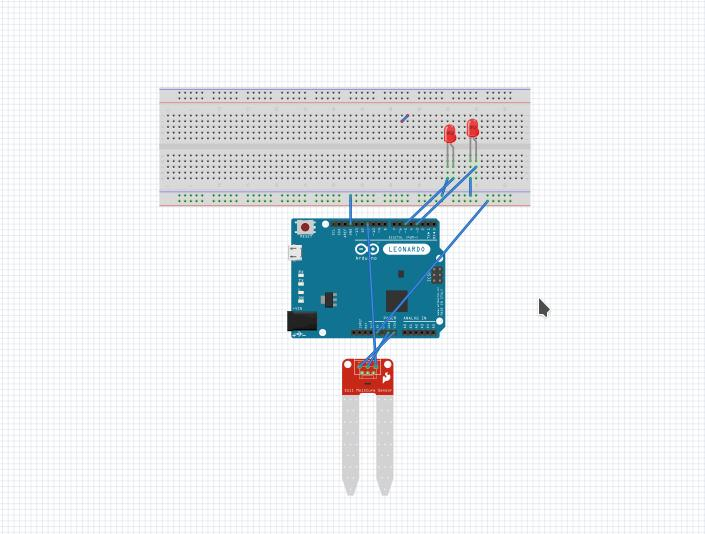
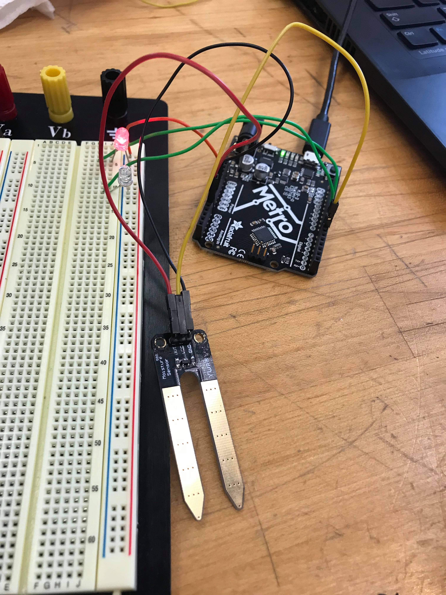

# Don't kill your plants!

**Author(s)**: Natasha Stallsmith and Tirtha Subedi

**Google Document**: https://docs.google.com/document/d/16PQsD9lrPFoG10iWvd56AJSm8ZgAgtpKkd_IgjPh894/edit?usp=sharing

---
## Purpose

We all love plants, we all need plants, and in fact, studies have shown that having plants around can help reduce stress. At the same time, however, indoor plants can be hard to take care of because it requires us remembering to water them which another task on top of all of the tasks we have to do. Not only that, but we have to remember when was the last time we watered them so as not to overwater them. Our hope is that though this project we can making caring for a plant much easier by creating an embedded system which measures the water density in your plants soil and lets you know (by a little light) when it is time to water your plant again.

## Initial Design Plan

**Hardware:**
- LEDs: Red and Green
- Soil moisture sensor
- Arduino metro
- Breadboard 
- Jumper Wires
- Solenoid Valve
- TIP120 transistor
- Diode
- 1K Ohm resistor

Here is the location for the project diagram: 
 file:///home/rajsubedi/Pictures/project12.jpeg
 
__Need:__ Updated diagram.
  
**Code:**

We will start with the AnalogReadSerial example code.

- Initialize all variables, including pin numbers and threshold value.

Setup:
- Begin serial moniter
- Declare pin modes
- Make sure no power is flowing to sensor

Loop:
- Take reading from sensor using readsoil function and print value to serial monitor
- If the moisture is over the threshold value, turn white light on and red light off
- If the moisture is below the threshold value, turn red light on and white light off, also open Solenoid valve for a short time
- Delay -- for testing is set to short value, but in practice can refresh about every 30 mins

Readsoil Function:
- Send power to sensor
- Delay a few milliseconds
- Read value from sensor
- Turn off power to sensor
- Return moisture level value

## Files

- README (you are here): Documentation of our project.
- LICENSE: Licensing info.
- design_diagram.jpeg: Diagram of our hardware design plan.
- Soil_Moisture_Project_1: The Arduino code file for the project.
- Soil_Moisture_Project_1.ino : The main code file

## Summary

## Instructions
   - First of all, Make sure all the parts and wires are connected and connect arduino metro to power supplier or to the laptop
   - Use the Soil moisture sensor to measure the moisture of soil (in our case it will be soil port)
   - Then LED light will light up determinding wheather the soil moisture is good or not, if it is good then Green LED will
     light up and if it's not then Red LED will light up.
   - Depending on LED light, User can water their plant/soil. 

## Errors and Constraints
   - Building circuit board when connecting different components.
   - Implementing the code (it gave lot of syntax errors)
   - Finding different moisture level soil to test 

## Reflection

## References

- https://www.instructables.com/id/Arduino-Soil-Moisture-Sensor/ - Instructions for connecting soil moisture sensor to Arduino Uno.
- https://learn.sparkfun.com/tutorials/soil-moisture-sensor-hookup-guide/all - Another instruction, this one explains how the values read from the sensor will differ according to the amount of power supplied to it.
- http://www.martyncurrey.com/controlling-a-solenoid-valve-from-an-arduino/ - Brief instructions for connecting Solenoid valve to Arduino
- https://www.bc-robotics.com/tutorials/controlling-a-solenoid-valve-with-arduino/ - Another set of instructions for connecting Solenoid valve to Arduino, this one has some coding examples

## Final Self-Evaluations

### Ideation, Brainstorming, Design:

*Natasha:*

*Tirtha:*

### Code creation: 

*Natasha:*

*Tirtha:*

### Documentation creation:

*Natasha:*

*Tirtha:*

### Teamwork & Participation:

*Natasha:*

*Tirtha:*
